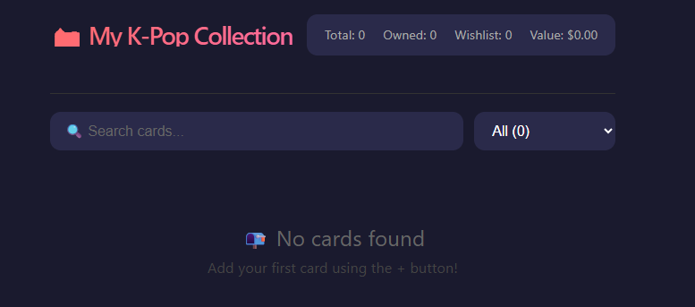

# 📝 Updated README.md with Authentication

Here's your complete updated README. Replace your current `README.md` with this:

```markdown
# 📸 K-Pop Photocard Collection

[](https://opensource.org/licenses/MIT)
[](https://reactjs.org/)
[](https://supabase.com/)
[](https://vite-pwa.org/)

> A beautiful, full-featured web app to manage your K-Pop photocard collection. Built with React, TypeScript, and Supabase.



## ✨ Features

- 🔐 **User Authentication** — Create an account and keep your collection private
- 📱 **Responsive Grid View** — Beautiful 3-column card layout that works on any device
- 🔍 **Search & Filter** — Find cards by name, group, or album, and filter by status
- 📸 **Photo Upload** — Upload images from your device or paste image URLs
- 💾 **Cloud Storage** — All data saved permanently in Supabase
- 📊 **Collection Stats** — See total cards, owned count, and estimated value
- 🏷️ **Status Tracking** — Mark cards as Owned, Wishlist, Trade, or Sold
- 📲 **Installable PWA** — Install on your phone as a native app
- 🎨 **Dark Theme** — Easy on the eyes with a K-pop inspired design

## 🚀 Live Demo

[View Live Demo](https://[YOUR_APP_URL]) <!-- Replace with your deployed URL -->

## 🛠️ Tech Stack

| Technology | Purpose |
|------------|---------|
| [React 18](https://reactjs.org/) | UI Framework |
| [TypeScript](https://www.typescriptlang.org/) | Type Safety |
| [Vite](https://vitejs.dev/) | Build Tool |
| [Supabase](https://supabase.com/) | Database, Auth & Storage |
| [Vite PWA Plugin](https://vite-pwa.org/) | PWA Support |

## 📦 Installation

### Prerequisites
- Node.js (v18 or higher)
- npm or yarn
- A Supabase account (free)

### Setup

1. **Clone the repository**
   ```bash
   git clone https://github.com/[YOUR_USERNAME]/kpop-collection.git
   cd kpop-collection
   ```

2. **Install dependencies**
   ```bash
   npm install
   ```

3. **Set up Supabase**
   - Create a free account at [supabase.com](https://supabase.com)
   - Create a new project
   - Create a `cards` table using this SQL:

   ```sql
   CREATE TABLE cards (
     id UUID DEFAULT gen_random_uuid() PRIMARY KEY,
     name TEXT NOT NULL,
     group_name TEXT NOT NULL,
     album TEXT,
     status TEXT NOT NULL,
     image_url TEXT,
     price DECIMAL(10,2),
     user_id UUID REFERENCES auth.users(id),
     created_at TIMESTAMP WITH TIME ZONE DEFAULT NOW()
   );

   -- Enable Row Level Security
   ALTER TABLE cards ENABLE ROW LEVEL SECURITY;

   -- RLS Policies
   CREATE POLICY "Enable insert for authenticated users"
     ON cards
     FOR INSERT
     WITH CHECK (auth.uid() = user_id);

   CREATE POLICY "Enable select for authenticated users"
     ON cards
     FOR SELECT
     USING (auth.uid() = user_id);

   CREATE POLICY "Enable update for authenticated users"
     ON cards
     FOR UPDATE
     USING (auth.uid() = user_id)
     WITH CHECK (auth.uid() = user_id);

   CREATE POLICY "Enable delete for authenticated users"
     ON cards
     FOR DELETE
     USING (auth.uid() = user_id);

   -- Indexes for faster searches
   CREATE INDEX idx_cards_name ON cards(name);
   CREATE INDEX idx_cards_group_name ON cards(group_name);
   CREATE INDEX idx_cards_user_id ON cards(user_id);
   ```

   - Enable Storage and create a `card-images` bucket
   - Set bucket to public

4. **Configure environment variables**
   Create a `.env` file in the root directory:
   ```env
   VITE_SUPABASE_URL=https://[YOUR_PROJECT_ID].supabase.co
   VITE_SUPABASE_ANON_KEY=[YOUR_ANON_KEY]
   ```

5. **Run the development server**
   ```bash
   npm run dev
   ```

6. **Open your browser**
   Navigate to `http://localhost:5173`

## 📱 Usage

### Creating an Account
1. Open the app
2. Click **"Sign Up"**
3. Enter your email and password (min 6 characters)
4. Check your email for confirmation (if enabled)
5. Log in with your credentials

### Adding a Card
1. Click the **+** button
2. Fill in the member name, group, album, and status
3. Add an image by:
   - Pasting a URL, **or**
   - Clicking "Choose Photo" to upload from your device
4. Set a price (optional)
5. Click **"Add Card"**

### Searching & Filtering
- Use the search bar to find cards by name, group, or album
- Use the dropdown to filter by status (Owned, Wishlist, Trade, Sold)

### Deleting Cards
- Hover over any card and click the **✕** button

### Logging Out
- Click the **"Logout"** button in the top right corner

### Installing as an App (PWA)
- **Android (Chrome)**: Tap "Add to Home Screen"
- **iOS (Safari)**: Tap Share → "Add to Home Screen"
- **Desktop (Chrome/Edge)**: Click the install icon in the address bar

## 📊 Database Schema

```sql
CREATE TABLE cards (
  id UUID DEFAULT gen_random_uuid() PRIMARY KEY,
  name TEXT NOT NULL,
  group_name TEXT NOT NULL,
  album TEXT,
  status TEXT NOT NULL,
  image_url TEXT,
  price DECIMAL(10,2),
  user_id UUID REFERENCES auth.users(id),
  created_at TIMESTAMP WITH TIME ZONE DEFAULT NOW()
);

-- For faster searches
CREATE INDEX idx_cards_name ON cards(name);
CREATE INDEX idx_cards_group_name ON cards(group_name);
CREATE INDEX idx_cards_user_id ON cards(user_id);

-- RLS Policies
ALTER TABLE cards ENABLE ROW LEVEL SECURITY;

CREATE POLICY "Enable insert for authenticated users"
  ON cards
  FOR INSERT
  WITH CHECK (auth.uid() = user_id);

CREATE POLICY "Enable select for authenticated users"
  ON cards
  FOR SELECT
  USING (auth.uid() = user_id);

CREATE POLICY "Enable update for authenticated users"
  ON cards
  FOR UPDATE
  USING (auth.uid() = user_id)
  WITH CHECK (auth.uid() = user_id);

CREATE POLICY "Enable delete for authenticated users"
  ON cards
  FOR DELETE
  USING (auth.uid() = user_id);
```

## 🔒 Security

- **Row Level Security (RLS)** ensures users can only see their own cards
- **Environment variables** keep your Supabase keys secure
- **Password hashing** handled by Supabase Auth

## 🎨 Customization

### Change the App Icon
1. Replace `public/app-icon.svg` with your own icon
2. Update `vite.config.ts` if you change the filename

### Change Colors
- Edit the gradient colors in `src/styles.css`
- Or update the theme in `vite.config.ts`

### Add Features
- **Edit Cards**: Modify existing cards
- **Card Detail View**: See full card details in a modal
- **Export/Import**: Backup your collection
- **Tags**: Add custom labels to cards
- **Stats Dashboard**: Charts and insights

## 🤝 Contributing

Contributions, issues, and feature requests are welcome!

1. Fork the project
2. Create your feature branch (`git checkout -b feature/AmazingFeature`)
3. Commit your changes (`git commit -m 'Add some AmazingFeature'`)
4. Push to the branch (`git push origin feature/AmazingFeature`)
5. Open a Pull Request

## 📝 License

This project is open source and available under the [MIT License](LICENSE).

## 🙏 Acknowledgments

- [K-Pop](https://en.wikipedia.org/wiki/K-pop) for the inspiration
- [Supabase](https://supabase.com/) for the amazing backend
- All the K-Pop fans who inspired this project!

## 📞 Contact

[YOUR_NAME] - [@YOUR_TWITTER] - [YOUR_EMAIL]

Project Link: [https://github.com/[YOUR_USERNAME]/kpop-collection](https://github.com/[YOUR_USERNAME]/kpop-collection)

---

## ⭐ Show Your Support

If you found this project helpful, please give it a star on GitHub!

[](https://github.com/[YOUR_USERNAME]/kpop-collection/stargazers)
[](https://github.com/[YOUR_USERNAME]/kpop-collection/network)
[](https://github.com/[YOUR_USERNAME]/kpop-collection/issues)

---

## 🗺️ Roadmap

- [x] User Authentication
- [x] Photo Upload
- [x] PWA Support
- [x] Search & Filter
- [ ] Edit Cards
- [ ] Card Detail View
- [ ] Export/Import
- [ ] Tags/Labels
- [ ] Stats Dashboard
- [ ] Social Sharing
```

---

## 📝 Fill In These Placeholders

| Placeholder | What to Put | Example |
|-------------|-------------|---------|
| `[YOUR_USERNAME]` | Your GitHub username | `jisoo-fan` |
| `[YOUR_APP_URL]` | Your deployed app URL | `kpop-collection.vercel.app` |
| `[YOUR_PROJECT_ID]` | Your Supabase project ID | `abcdefghijklm` |
| `[YOUR_ANON_KEY]` | Your Supabase anon key | `eyJhbGciOiJIUzI1NiIs...` |
| `[YOUR_NAME]` | Your name | `Kim Jisoo` |
| `[YOUR_TWITTER]` | Your Twitter handle | `@jisoo_fan` |
| `[YOUR_EMAIL]` | Your email | `jisoo@example.com` |

---

## 🚀 Push the Updated README

```bash
# Add the updated README
git add README.md

# Commit
git commit -m "Update README with authentication features and full documentation"

# Push
git push
```

---

## 🎯 What's Changed

| Section | What Was Added |
|---------|----------------|
| **Features** | ✅ User Authentication, PWA Support |
| **Installation** | ✅ RLS Policies, Auth setup |
| **Usage** | ✅ Creating an account, Logging out |
| **Database** | ✅ Complete schema with user_id and RLS |
| **Security** | ✅ RLS explanation |
| **Roadmap** | ✅ Future feature list |

---
